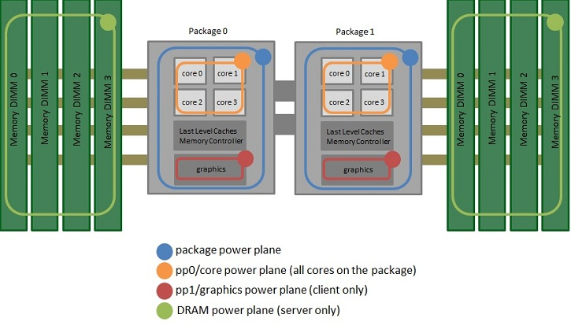

# rapl-reader
Framework for reading energy consumption estimates from RAPL counters on linux while running programs in specific languages.

# Requirements
The framework is currently only compatible for devices matching the following requirements:
* Laptop or computer with an Intel CPU
* CPU architecture is no older than Sandy Bridge (~2011-present)
* Linux 3.13 or later.
* Bash.
* C++.

While any device matching these requirements should be compatible, currently only the following operating systems are tested:
* Ubuntu 18.04
* Ubuntu 20.04

Lastly, the framework can be used to measure the energy consumption of any program written in any given language. However, for new languages to be supported, scripts must be added to support those languages. More on this below in "Supporting new Languages". Currently, the following languages are already supported:
* C++
* Java
* Python3

# How to Use
After downloading the framework, the firs thing you should do is to verify the compatibility by running:
```
cd raplReader/rapl_read/
sudo ./rapl-read -i
```
This should return information on the CPU, the amount of Cores and the Packages. If this fails, the framework is not able to read the information from your CPU, and cannot work. In this case, verify that your device is compatible, or read further below in "Issues".

If the command does work, run the following to orient yourself on the data that can be read:
```
sudo ./rapl-read -v
```
This should return a string with the values values that can be measured. Apart from the Time in microseconds, all other values will be in Joule. The exact meaning of these different values is explained below in "Understanding RAPL Counters".

To measure the energy consumption of a program, place its executable somewhere in the *codebase* directory, and add it to either "run_all.sh" or any other scripts included in "run_all.sh" in the *raplReader/scripts/experiment* directory. Make sure these additions following the instructions in "run_all.sh". In case of a new language, make sure support for the language is given as explained below in "Supporting new Languages".

If these steps have been followed correctly, you can start the measurements as follows:
```
sudo ./run_all.sh
```
This should take all programs linked through "run_all.sh" sequentially, and run them each 50 times while measuring the energy consumption. The amount of repetitions, and the time in between repetitions, can be edited in "run.sh"
Afterwards, the measurements should be stored in the "results" directory, and mimic the same structure as the codebase structure.

All scripts executed from the command line should have root priviliges.


# Understanding RAPL Counters
The RAPL counters are provided on Intel CPUs to give estimates on the energy consumption of different components linked to the CPU. The RAPL counters are structured into different powerplanes, which provide estimates for different parts of the device:


*source: https://blog.chih.me/read-cpu-power-with-RAPL.html*

* The package power plane *(p0,...)* provides estimates on the energy consumption of the specific processor, including * the consumption by both the cores and uncore devices, and other processor components.
* The cores power plane *(pp0)* provides estimates on the energy consumption of all cores in the package combined.
* The uncore power plane *(pp1)* provides estimates on the enrgy consumption of the uncore devices such as graphics in the package. This plane is not always available.
* Lastly, DRAM provides estimates on the energy consumption of the memory components of the computer connected to the processor.
Generally, it holds that pp0 + pp1 <= p0, as both the cores and uncore components are included in the package estimates. DRAM is however independent from the other three.

More information on the RAPL counters and their measurments can be found here: https://blog.chih.me/read-cpu-power-with-RAPL.html

# Supporting new Languages
A new Language can be supported by adding a simple bash script to the scripts directory that, provided a Path, a Filename and any Input arguments, will execute the given file at the given path with the given arguments for the specific language.
Examples can be found in the "raplReader/scripts/experiment" directory in the files "run_cplus.sh", "run_java.sh", and "run_py.sh".

# Issues
Currently, the framework has only been tested in limited capacity, and some issues might remain.

## CPU not recognized
If the framework fails to read the CPU value, verify that your device meets the requirements. If this is the case, and the CPU is relatively new (2017-present), it might be that support has not yet been added. This can be done by editing "rapl-read.c" in "rapl_read/" to include the family code of the architecture of the CPU and recompile it using the commands included in the file's header. Ignore any warnings during compilation.

## Measurements retuning only 0s
This indicates that while the framework works, you are not actually reading the values. This might be due to a lack of root priviliges. Make sure your run the commands with `sudo` in the front.

## Otherwise
If the previous cases do not solve the issues, this might not currently be a simple solution. You could attempt to manually modify the framework to support more methods than just the sysfs powercap interface. Some examples of this can be found in the links provided in the "Credits" section. 

# Credits
Framework originally developed by Sander van Oostveen.

rapl-read.c modified from code provided by Vince Weaver: vincent.weaver@maine.edu: http://web.eece.maine.edu/~vweaver/projects/rapl/

Insights into RAPL counters and methods to read them: https://blog.chih.me/read-cpu-power-with-RAPL.html
